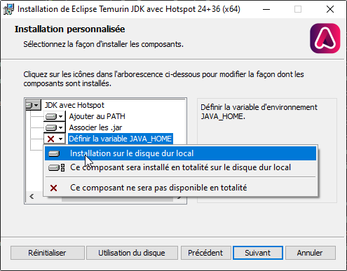
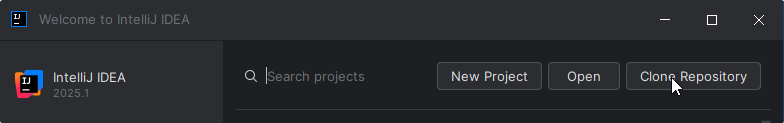
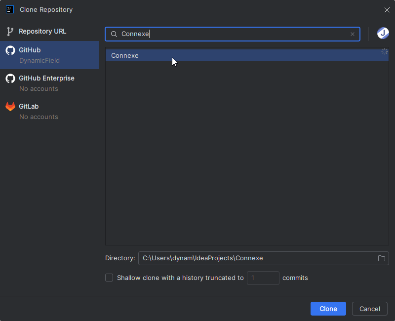
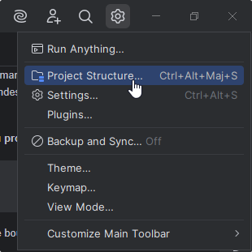
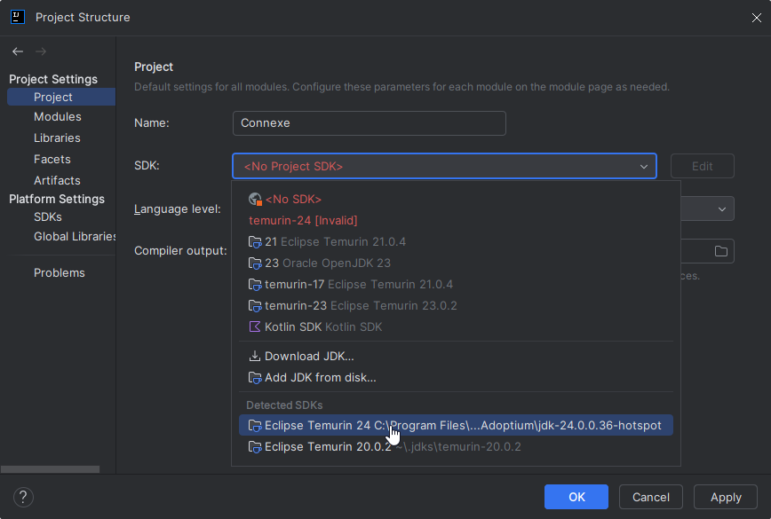

# Projet Connexe

Le projet labyrinthique...

## Logiciels et éditeurs à installer

### Java 24
On doit tous avoir la même version de Java pour éviter les problèmes sournois, alors avoir la plus récente qui vient de sortir...

- **Windows** : [Télécharger l'installer](https://github.com/adoptium/temurin24-binaries/releases/download/jdk-24%2B36/OpenJDK24U-jdk_x64_windows_hotspot_24_36.msi) 
 puis **(important)** activer l'option "JAVA_HOME" 
- **Linux** : c'est plus dur, faut lancer tout un tas de commandes (1 ligne = une commande)
```bash
# Commande 1
wget -qO - https://packages.adoptium.net/artifactory/api/gpg/key/public | sudo gpg --dearmor | sudo tee /etc/apt/trusted.gpg.d/adoptium.gpg > /dev/null
# Commande 2
echo "deb https://packages.adoptium.net/artifactory/deb $(awk -F= '/^VERSION_CODENAME/{print$2}' /etc/os-release) main" | sudo tee /etc/apt/sources.list.d/adoptium.list
# Commande 3
sudo apt update && sudo apt install -y temurin-24-jdk
```

### IntelliJ Community/Ultimate
Alors ça en *théorie* chacun prend son éditeur de code selon ses goûts, mais en pratique ça va aboutir à plein de problèmes du genre « oh mais chez moi ça marche mon IDE il fait ça mais pas toi », « ah mais c'est bizarre on a pas le même paramètre », « mais comment on lance le programme ?!! y'a pas le bouton lancer », etc.

Alors autant tous avoir le même IDE pour qu'on travaille tous de la même façon : **IntelliJ Ultimate** (ou [Community](https://www.jetbrains.com/idea/download/?section=windows#community-edition) si flemme)
C'est mieux que Eclipse (mon avis incontestable) et VSCode (mon avis contestable) pour faire du Java.

Avec notre e-mail CYU/CY Tech on peut avoir la version payante (**Ultimate**) **gratuitement** !
- Remplir le [formulaire étudiant de Jetbrains](https://www.jetbrains.com/shop/eform/students), ce qui crée un compte Jetbrains
- Télécharger IntelliJ Ultimate (sauf si déjà installé)
- Se connecter avec le compte Jetbrains sur IntelliJ

### SceneBuilder

SceneBuilder permet de créer graphiquement des interfaces JavaFX en FXML. Il est préinstallé
sur les PC de CY (sur Ubuntu, sur Windows je sais plus).

- [Télécharger pour Windows](https://gluonhq.com/products/scene-builder/thanks/?dl=https://download2.gluonhq.com/scenebuilder/RC/24.0.0-RC1/install/win/SceneBuilder-24.0.0-RC1.msi)
- [Télécharger pour Linux](https://gluonhq.com/products/scene-builder/thanks/?dl=https://download2.gluonhq.com/scenebuilder/RC/24.0.0-RC1/install/linux/SceneBuilder-24.0.0-RC1.deb)


## Télécharger le projet

- **À la main sur le terminal :** `git clone https://github.com/DynamicField/Connexe.git`  
  Puis le projet sera dispo dans le dossier `Connexe`.
- **Avec IntelliJ :** (N'oubliez pas de vous connecter avec GitHub dessus)
  
  


## Lancer le projet

Plusieurs techniques sont valables :
- **Sur le terminal :** `./gradlew run`
- **Sur IntelliJ :**    
   

Si c'est tout cassé (hautement probable, de toute façon ça marche jamais du premier coup ces histoires), regardez ce qu'il y
a d'écrit juste en dessous...


## Ça marche pas...

**Problème :** Quand je fais `./gradlew run` ça dit 
- 'gradlew.bat' n’est pas reconnu en tant que commande interne
ou externe, un programme exécutable ou un fichier de commandes 
- Command 'gradlew' not found

**Raison :** Pas dans le bon dossier !

**Solution :** Mettez-vous **dans le bon dossier du projet dans le terminal** avec `cd` :
```
❌ PS C:/Users/Dev> cd Projets/Connexe
✔ PS C:/Users/Dev/Projets/Connexe>
```

**Problème :** Quand je fais `./gradlew run` ou le bouton pour lancer sur IntelliJ ça dit :
```
Cannot find a Java installation on your machine (Windows 10 10.0 amd64) matching: {languageVersion=24, vendor=any vendor, implementation=vendor-specific, nativeImageCapable=false}. Toolchain download repositories have not been configured.
```

**Raison :** Vous n'avez pas Java 24, ou bien Gradle ne sait pas où il est.

**Solutions :**
- **Windows seulement :** Recommencer l'installation de Java 24 en veillant bien 
  à activer l'option `JAVA_HOME`, puis redémarrer le PC
- **Linux seulement :** Recommencer l'installation de Java 24 en lançant seulement la 3e commande, puis
  changer le JDK par défaut à celui de Java 24 avec la commande `sudo update-alternatives`.
- **IntelliJ seulement :** Changer le JDK utilisé par le projet en allant dans "Project Structure" :  
       
  Si IntelliJ ne trouve pas le JDK tout seul, essayez d'aller dans l'onglet "SDK" de "Project Structure" et 
  de l'ajouter vous-même.   
  Si vous y arrivez toujours pas c'est sûrement parce que vous 
  avez oublié d'installer Java 24, voilà tout...
  

## Génération de Javadoc

Le script `javadoc` (ou `javadoc.bat` pour Windows) permet de générer la Javadoc automatiquement et de l'afficher
sur le navigateur. 

La Javadoc est générée par Gradle (tâche `:javadoc`) et est disponible dans le dossier `build/docs/javadoc`.

----

## Règles de contribution

1. La branche `main` **ne PEUT PAS recevoir de commits directement.** Toute tentative de commit sur `main` sera bloquée par GitHub.
2. Pour **commencer à modifier le code**, **une branche séparée doit être créée**. (Exemple : j'ajoute les paramètres, j'appelle ça `feature/settings-dialog`)
3. Une fois la **modification de code aboutie**, une **Pull Request** doit être crée pour **appliquer les changements** sur la branche `main`.
4. Le code de chaque **Pull Request** doit être **entièrement approuvé et relu par une personne** (autre que son créateur, bien sûr)

**Remarque :** Quand vous travaillez sur une branche séparée (exemple de `feature/settings-dialog`), n'oubliez pas de régulièrement mettre à jour la branche pour avoir les changements du `main`, en effectuant un **rebase** de votre branche sur le main.

## Règles du code

**IMPORTANT :** Pour que du **code** d'une **Pull Request** soit **validé** sur la branche `main`, elle doit **remplir tous ces critères**.

1. Tous les **commentaires** et **symboles** du code (noms de variables, de classes, de fonctions) **doivent être en anglais** (consigne du projet)
2. Le **code des fonctions** doit être **suffisamment commenté**, minimum **1 commentaire par 5 lignes** de code environ
3. Chaque **fonction, classe et constructeur public** doit comporter **un commentaire Javadoc au [format Markdown](https://docs.oracle.com/en/java/javase/23/javadoc/using-markdown-documentation-comments.html)** expliquant rapidement son fonctionnement (hormis les getters/setters car casse-couille, mais dans ce cas **mettre une Javadoc sur l'attribut de classe**). Voilà un exemple :
    ```java
     /// A **directed graph** with a fixed number of N vertices, each identified by an integer (`int`) index from 0 to N.
     public class DirectedGraph {
        /// The total number of vertices of this graph.
        private final int num;
    
        /// Creates a new directed graph with `n` vertices. `n` must be positive. 
        public DirectedGraph(int n) { ... }
    
        /// Adds an edge from vertex `a` to `b`. Does nothing if the edge already exists.
        ///
        /// @return True when the edge already exists, false when it was created
        public boolean addEdge(int a, int b) { ... }
    
        public int getNum() { return num; }
     }
    ```

## Liens utiles

- [Guide de JavaFX](https://fxdocs.github.io/docs/html5/)